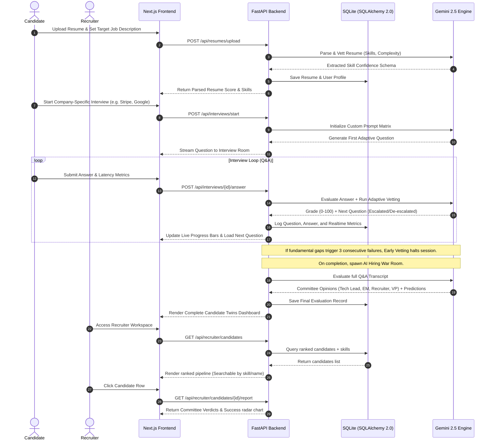

# 🧠 NextHire — AI Hiring Intelligence Operating System
# 🧠 NextHire — AI Hiring Intelligence Platform

[](https://nextjs.org)
[](https://fastapi.tiangolo.com)
[](https://deepmind.google/technologies/gemini/)
[](https://deepmind.google/technologies/gemini/)
[](https://sqlite.org)

> A state-of-the-art AI Hiring Intelligence Operating System designed to automate early screening, eliminate resume padding deception through adaptive Q&A, and provide recruiters with multi-persona engineering intelligence. Powered by **Gemini 2.5 Flash Lite** & **FastAPI** & **Next.js 16**.
> NextHire is an AI-powered hiring intelligence platform that automates resume screening, conducts adaptive interviews, evaluates technical skills, and provides recruiters with data-driven hiring insights.
---

## 🚀 Live Demo

🌐 Live Application: https://your-live-url.com

🎥 Video Demo: https://vimeo.com/1200711181

---

## 🌟 Pitch & Vision
## 🌟 Overview

Traditional technical screening is broken. Engineering managers waste valuable sprint hours interviewing candidates with padded resumes, while candidates suffer through rigid, sterile questionnaires that fail to capture their true learning velocity or communication under pressure.
Traditional hiring processes are time-consuming, inconsistent, and heavily dependent on manual screening.

**NextHire** redefines hiring intelligence by transforming technical vetting into a multi-dimensional, adaptive experience. It operates as a dual-sided workspace:
NextHire solves these challenges by combining Artificial Intelligence, adaptive interviews, skill verification, and recruiter analytics into a single platform.

*   **For Candidates**: An interactive live interview simulator with an **Adaptive Difficulty Controller** that escalates or de-escalates questions in real time. It evaluates not just syntax, but communication patterns, response latency, and pressure resilience, followed by an **AI Career Coach** that builds custom learning roadmaps.
*   **For Recruiters**: A unified Hiring War Room workspace containing candidate rankings, skill verification confidence levels, and automated hiring verdicts generated by a simulated committee of tech executives.
The system helps:

---
### Candidates
- Upload and analyze resumes
- Receive AI-driven interview experiences
- Track performance and skill development
- Access personalized career recommendations

## 🎥 Video Demonstration
### Recruiters
- Evaluate candidates efficiently
- Verify skills against resume claims
- View AI-generated hiring insights
- Make data-driven hiring decisions

Check out our full walkthrough and product pitch:
---

👉 **[Watch NextHire Demo on Vimeo](href="https://vimeo.com/1200711181")**
## ✨ Features

### 📄 Resume Intelligence
- Resume upload and parsing
- Skill extraction
- Candidate profiling
- Resume scoring

### 🎯 Job Description Analyzer
- Resume vs JD comparison
- Skill gap identification
- Match percentage calculation
- Optimization recommendations

### 🎤 Adaptive AI Interviews
- Dynamic interview difficulty
- Real-time candidate evaluation
- Technical and behavioral questioning
- Automated scoring

### 📊 Recruiter Dashboard
- Candidate ranking
- Interview performance metrics
- Skill verification indicators
- Hiring recommendations

### 🤖 AI Career Coach
- Personalized learning roadmaps
- Career guidance
- Skill improvement suggestions
- Progress tracking

### 🔔 Real-Time Notifications
- Interview updates
- Recruiter alerts
- Candidate progress updates

### 🔐 Authentication System
- Secure login and signup
- JWT authentication
- Firebase integration

---

## 🚀 Key Vetting Pillars
## 🏗️ Architecture

### 1. Adaptive Technical Interview Vetting
The system begins the interview at the candidate's verified baseline. Based on their performance, the difficulty level shifts dynamically:
*   **Strong Answers (Score $\ge 85$)**: Difficulty escalates. The AI pivots to deep architectural follow-up questions, system trade-offs, and optimization limits.
*   **Average Answers ($60 \le \text{Score} < 85$)**: Difficulty remains stable while pivoting sideways to cover parallel concepts.
*   **Weak Answers (Score $< 60$)**: Difficulty de-escalates to fundamental concepts to locate the candidate's exact competency floor.
```text
NextHire
│
├── Frontend (Next.js + TypeScript)
│   ├── Dashboard
│   ├── Resume Analyzer
│   ├── Live Interview
│   ├── Recruiter Workspace
│   ├── Career Coach
│   └── Authentication
│
├── Backend (FastAPI)
│   ├── Authentication APIs
│   ├── Resume Processing
│   ├── Interview Engine
│   ├── Recruiter APIs
│   └── AI Services
│
├── Database
│   ├── SQLite
│   └── SQLAlchemy ORM
│
└── AI Layer
    ├── Gemini AI
    ├── Resume Analysis
    ├── Interview Evaluation
    └── Career Coaching
```

### 2. Early Termination Guard
To save time and resources, the system constantly monitors performance. If a candidate registers multiple consecutive critical failures, the guard halts the interview, records the exact skill gaps, and terminates the session gracefully.
---

### 3. AI Hiring War Room Committee
Once an interview is completed, a simulated panel of four technical personas reviews the transcript and logs:
*   **Technical Lead**: Analyzes algorithmic correctness, caching layers, and database choices.
*   **Engineering Manager**: Vets collaborative patterns, sprint delivery alignment, and agile scoping.
*   **Lead Recruiter**: Cross-references resume claims with live interview answers to verify authenticity.
*   **VP of Engineering**: Judges long-term growth potential, system limits, and strategic architectural value.
## 🛠️ Tech Stack

### 4. Digital Twin Analytics & Success Predictions
All evaluation data is mapped into a **Digital Candidate Twin**:
*   **Success Predictions**: Renders percentage probabilities for Offer Success, 90-Day Performance, and Retention Rate.
*   **Talent Benchmarking**: Renders candidate percentile ranks against top-tier global peers.
*   **Learning Velocity**: Charts candidate learning acceleration based on how quickly they adapt to hints.
### Frontend
- Next.js 16
- React 19
- TypeScript
- Tailwind CSS
- Framer Motion

---
### Backend
- FastAPI
- Python
- SQLAlchemy
- Pydantic

## 🗺️ System Architecture

The diagram below illustrates how candidate metadata flows through NextHire's specialized AI agents to generate real-time evaluations and recruiter decision telemetry:


### Database
- SQLite
- SQLAlchemy ORM

### AI
- Google Gemini AI

### Authentication
- Firebase Authentication
- JWT Tokens

---

## 📂 Project Structure

```text
NextHire/
├── src/                          # Next.js 16 Frontend
│   ├── app/                      # App Router Views
│   │   ├── dashboard/            # Candidate Main Dashboard
│   │   │   ├── achievements/     # Gamification & Badges unlocked
│   │   │   ├── career-coach/     # Customized roadmap sprints (7-90 days)
│   │   │   ├── jd-analyzer/      # Job Description Matcher Workspace
│   │   │   ├── live-interview/   # Adaptive technical Q&A room
│   │   │   ├── recruiter/        # Recruiter Panel & AI War Room committee details
│   │   │   └── resumes/          # Resume upload & parsing intelligence
│   │   ├── login/                # Auth Login View
│   │   ├── signup/               # Auth Sign Up View
│   │   └── onboarding/           # Candidate target position onboarding setup
│   ├── components/               # Layout elements (Sticky Navigation, Sidebar, AI Copilot)
│   └── utils/                    # Frontend API utilities
├── backend/                      # FastAPI Backend
│
├── src/
│   ├── app/
│   │   ├── main.py               # Lifespan app entry, CORS, and routers mounting
│   │   ├── database.py           # Async SQLAlchemy Engine & SessionLocal
│   │   ├── models/               # Declarative DB Models (User, Resume, Interview, Evaluation, etc.)
│   │   ├── schemas/              # Pydantic Schemas
│   │   ├── routers/              # API Route Handlers (Auth, Recruiter, Interviews, Coach, etc.)
│   │   ├── agents/               # Gemini AI Agents (Base Agent + Specialized Persona Evaluators)
│   │   ├── services/             # Core engines (Interview orchestrator, Scoring, Coaching)
│   │   └── utils/                # Resilient file parsers and bcrypt encoders
│   ├── requirements.txt          # Python dependencies
│   ├── migrate_db.py             # Schema upgrade script
│   └── .env.example              # Environment blueprint
└── README.md                     # NextHire Documentation
│   │   ├── dashboard/
│   │   ├── login/
│   │   ├── signup/
│   │   └── onboarding/
│   │
│   ├── components/
│   └── utils/
│
├── backend/
│   ├── app/
│   │   ├── models/
│   │   ├── schemas/
│   │   ├── routers/
│   │   ├── agents/
│   │   ├── services/
│   │   └── utils/
│   │
│   ├── requirements.txt
│   └── migrate_db.py
│
├── public/
├── README.md
└── LICENSE
```

---

## 🛠️ Technological Stack
## ⚡ Installation

| Tier | Technologies Used | Details |
|---|---|---|
| **Frontend** | React 19, Next.js 16, TypeScript | Core application shell & responsive dashboard layout. |
| **Styling** | Tailwind CSS v4, Framer Motion | Smooth gradients, glassmorphic interfaces, and spring animations. |
| **Backend** | Python 3.13, FastAPI | High-performance asynchronous API endpoints and router. |
| **Database** | SQLAlchemy 2.0, SQLite, aiosqlite | Asynchronous SQLite connection matching JSON relational structures. |
| **AI Layer** | Gemini 2.5 Flash Lite, Direct Google GenAI SDK | Multi-persona prompts, structured JSON outputs, and adaptive difficulty. |
| **Auth** | Passlib, Bcrypt, PyJWT | Salted hashing and JSON Web Tokens for API requests authorization. |
### Clone Repository

---

## 🔌 API Endpoints Documentation
```bash
git clone https://github.com/Yukta062006/NextHire.git
cd NextHire
```

### 1. Authentication (`/api/auth`)
*   `POST /api/auth/register`: Register a new candidate or recruiter account.
*   `POST /api/auth/login`: Authenticate and receive a JWT access token.
*   `GET /api/auth/me`: Get profile data for the currently logged-in user.
### Frontend Setup

### 2. Resumes & Job Profiles (`/api/resumes`)
*   `POST /api/resumes/upload`: Upload and parse a PDF/DOCX resume file using Gemini parsing.
*   `GET /api/resumes/latest`: Retrieve the user's latest parsed resume metrics.
```bash
npm install
npm run dev
```

### 3. Interview Simulations (`/api/interviews`)
*   `POST /api/interviews/start`: Start a new company-specific interview simulation (e.g. Google, Netflix, Amazon).
*   `POST /api/interviews/{id}/answer`: Submit an answer to the current question. Returns grade and the next adaptive question.
*   `POST /api/interviews/{id}/end`: Manually complete or abort the interview session.
*   `GET /api/interviews/{id}/replay`: Retrieve the chronological Q&A transcript, answer grades, and response times.
Frontend runs on:

### 4. Recruiter Dashboard (`/api/recruiter`)
*   `GET /api/recruiter/candidates`: Retrieve all registered candidates ranked by their NextHire score (includes skills).
*   `GET /api/recruiter/candidates/{id}/report`: Retrieve the detailed hiring verdict report, war room evaluations, and success predictions.
```text
http://localhost:3000
```

---

## ⚡ Quick Start & Installation
### Backend Setup

Follow these steps to run the complete NextHire system locally:
```bash
cd backend
pip install -r requirements.txt
```

### Prerequisites
*   **Python 3.12+** (Python 3.13 recommended)
*   **Node.js 18+** (Node.js 20 recommended)
*   A **Google Gemini API Key** (Get one from [Google AI Studio](https://aistudio.google.com/))
Create:

---
```text
backend/.env
```

### Step 1: Run the Backend API

1.  Navigate to the `backend` folder:
    ```bash
    cd backend
    ```
2.  Install Python dependencies:
    ```bash
    pip install -r requirements.txt
    ```
3.  Set up environment variables:
    *   Create a `.env` file from the blueprint:
        ```bash
        cp .env.example .env
        ```
    *   Open `.env` and set your Gemini API key:
        ```env
        GOOGLE_API_KEY=your_gemini_api_key_here
        ```
4.  Run database schema migrations to initialize all tables and columns:
    ```bash
    python migrate_db.py
    ```
5.  Start the FastAPI server:
    ```bash
    python -m uvicorn app.main:app --host 0.0.0.0 --port 8000
    ```
    The backend server will run on **`http://localhost:8000`**.
Add:

```env
GOOGLE_API_KEY=your_gemini_api_key
```

Run:

```bash
python migrate_db.py
python -m uvicorn app.main:app --reload --port 8000
```

Backend runs on:

```text
http://localhost:8000
```

---

### Step 2: Run the Next.js Frontend
## 🎥 Demo Video

Watch the complete project walkthrough:

1.  Open a new terminal session in the **root project directory**.
2.  Install Node dependencies:
    ```bash
    npm install
    ```
3.  Start the development server:
    ```bash
    npm run dev
    ```
    The Next.js frontend will run on **`http://localhost:3001`** (or port `3000` if free).
https://vimeo.com/1200711181

---

## 🏆 Platform Design Highlights
## 🙏 Acknowledgements

*   **Resilient Fallbacks:** The platform includes structured mock fallbacks in `base_agent.py`. If the application runs without configuring a Gemini API key or experiences rate limits, all dashboards, radars, and live interview rooms remain fully populated and functional.
*   **Zero-signup Onboarding:** Candidates can experience onboarding, resume uploading, and live technical interviews under guest credentials without forced login flows.
*   **Direct Bcrypt Hashing:** Built direct Python 3.13 compatible bcrypt hashing to bypass standard passlib library dependencies, ensuring total runtime stability.
NextHire is based on the open-source NextHire project and has been significantly enhanced with:

- Custom NextHire branding
- UI redesign and animations
- Authentication improvements
- Dashboard enhancements
- Bug fixes and optimizations
- Additional recruiter and candidate features

The original project provided the foundation upon which NextHire was further developed.

---

## 👨‍💻 Developer

<div align="center">
  <p><strong>Candidate Vetting & AI Recruiter Workspace Dashboards</strong></p>
</div>
**Yukta Thakur**


GitHub:
https://github.com/Yukta062006


Project:
NextHire – AI Hiring Intelligence Platform

---

*NextHire features high engineering complexity and seamless executive decision telemetry.*
## 📄 License

This project is licensed under the MIT License.

See the LICENSE file for details.